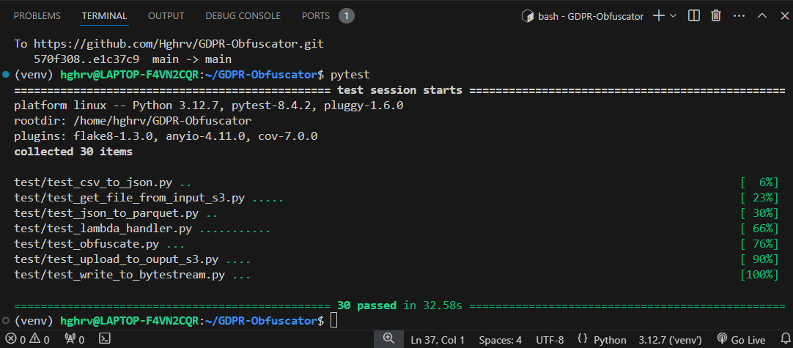
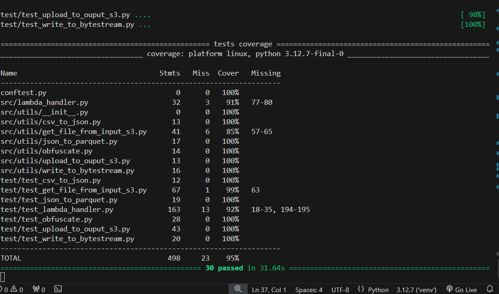
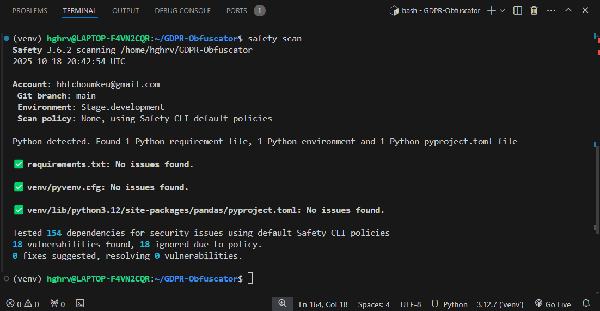

# GDPR-Obfuscator

Obfuscator Project for sensitive data under UK GDPR (General Data Protection Regulation, United Kindom).

This project provides an efficient and secure obfuscating tool that meets current GDPR requirements and that can effectively be used to process sensitive data uploaded to a S3 location in a valid AWS account. S3 offers a secure, flexible and scalable solution as the tool can easily be integrated in third party applications, for example by cloning or importing the repository as a library module into a Python codebase, or by setting a synchronised streaming event bridge on the AWS console.

## Context

The present project aims at providing a general-purpose tool to process data being ingested to AWS and intercept personally identifiable information (PII).

Since information stored by Northcoders data projects are intended for bulk data analysis only, there is a requirement under UK GDPR to ensure that all data containing information that could be used to identify an individual should effectively be anonymised.

## The legal framework

Under UK domestic law, the General Data Protection Regulation or UK GDPR is a comprehensive data protection law that came into effect on 25 May 2018, alongside an revised version of the Data Protection Act 2018.

According to [https://www.gov.uk/data-protection](https://www.gov.uk/data-protection), data protection in the UK is mainly governed by the UK GDPR and the Data Protection Act of 2018. UK data protection principles specifically restricts how personal information is used by organizations in order to ensure data protection and privacy for individuals (data subjects).

These ‘data protection principles’ are strict rules requiring that people or entities responsible for using personal data must ensure (unless an exemption applies) the following legal requirements are met:

    - Fair, lawful and transparent use of data

    - Use of information for specific purposes

    - Adequate and relevant use of information limited to only necessary data

    - Accuracy and update of information

    - Data Storage no longer than is necessary

    - Appropriate data integrity and security, including protection against unlawful or unauthorised processing, access, loss, destruction or damage

In addition to those legal requirements, there is also a strong emphasis on the processing of more sensitive data (Ex: race, ethnicity, religion, biometric id, health, background checks etc.) as data subjects carry fundamental rights such as the right to transparency and access to information, right to rectification/erasure, objections and also restrictions on automated decision-making. Therefore personal data must also be handled in accordance with these principles.

## Descriptive Overview of the Project

### Objectives

The GDPR framework described previously actually constitutes the rationale for building and Obfuscator to secure sensitive data. In this project we will precisely follow those personal data guidelines as stated in the UK legislation at: <https://www.legislation.gov.uk/eur/2016/679/contents>

(The Principles relating to processing of personal data, Article 5 to Article 11A).

Building our Data Obfuscator library under GDRP regulation and guidelines ensures that data processing platforms and developers can have a viable and optimal option at hand providing up-to-date and secured solutions.

### Minimal Viable Product (MVP)

Building a fully tested and automated GDPR Obfuscator for deployment on AWS and third-party software integration, in other words an obfuscation tool that can be integrated as a library module into a Python codebase.

The tool is to be supplied with the S3 location of a file containing sensitive information, and the names of the affected fields. It is expected to handle files of up to 1MB with a runtime of less than 1 minute tand create a new file or byte stream object containing an exact copy of the input file but with the sensitive data replaced with obfuscated strings. Each calling procedure handles processing the content of the unique input key and saving the output to its destination with an unique output key . The tool can securely work within an AWS account or provided AWS credentials as this project aims to demonstrate.

### Framework and Purpose

      Linux CLI

      Python 3

      AWS_cli for AWS access via control line interface

      Terraform for AWS resources creation

      Pytest for testing

      Boto3 for aws s3_client handling

      Moto  for mock-testing / secret-manager

      Make for automated project setup

## How to use

The setup process follows 5 required steps in the order listed below. Instructions for each step are detailed in the next section 'Installation and Configuration'. Please read all instructions carefully.

step 1: Clone the current repository / Create and activate virtual environment / Export PYTHONPATH environment variable as the current working directory

Step 2: Install AWS_cli 1.42.40 and configure AWS credentials

Step 3: Install project requirements as specified in requirements.txt

Step 4: At this point you should be able to run pytest with all 30 tests passing succesfully

Step 5: Install Terraform (If you wish to use terraform scripts for further AWS development)

      sudo apt install terraform=1.13.3-1

    (Note the required version of terraform 1.13.3-1 installed using 'apt' installer instead of 'pip'.)

    
Important notice:

    Make sure that AWS_CLI is installed and AWS credentials are configured with the provided credentials, prior to running pytest, in order to ensure that all 30 tests are passing, otherwise there would be 21 tests passing and 9 failing. This is because those 9 tests are testing the lambda_handler.py on the actual AWS IAM account, so they are not using mock-S3 buckets like the tests for composite units.

  Usage and Examples:

  This general-purpose tool to process data being ingested to AWS and intercept personally identifiable information (PII). A Json event for this purpose requires a file key (here the input key s3://gdpr-data-storage/new_data/test_file.csv) and PII fields to obfuscate (here the name and email address) in order to trigger the Lambda handler.

  When a csv file containing is sent into the input s3 bucket with the key s3://gdpr-data-storage/new_data/test_file.csv, the stored file with be reset with the table's new content.

  This new object will trigger the Lambda and the obfuscated file will be reset in the output s3 bucket with the key s3://'obfuscated_data/obfuscated-file.csv'.

  The tool can also handle valid Json and Parquet files. In that case set the input file key with .json or .paquet extension ( for example, s3://gdpr-data-storage/new_data/test_file.jon or s3://gdpr-data-storage/new_data/test_file.parquet)

Example of valid Csv content:

    student_id,name,course,cohort,graduation_date,email_address
    1234,'John Smith','Software','December','2024-03-31','j.smith@email.com'

Example of valid Json content:

    {
      "student_id": 1234,
      "name": 'John Smith',
      "course": 'Software',
      "cohort": 'December',
      "graduation_date": '2024-03-31',
      "email_address": 'j.smith@email.com'
    }

Example of valid Parquet content:

    {
      "student_id": [1234],
      "name": ['John Smith'],
      "course": ['Software'],
      "cohort": ['December'],
      "graduation_date": ['2024-03-31'],
      "email_address": ['j.smith@email.com']
    }

Example of valid bucket name and file key

      <bucket name>   'gdpr-data-storage'
      
      <file key>      'new_data/test_file.csv'
      
      <input path>          s3://{bucket_name}/{file_key}
              or      s3://gdpr-data-storage/new_data/test_file.csv
              or      s3://gdpr-data-storage/new_data/test_file.json
              or      s3://gdpr-data-storage/new_data/test_file.parquet

      <output path>   s3:/obfuscated_data/obfuscated-file.csv
              or      s3://obfuscated_data/obfuscated-file.json
              or      s3://obfuscated_data/obfuscated-file.parquet

Notes:

Note that  bucket names must be unique in AWS, so ensure to provide correct bucket name and input key and also make sure to retrieve the correct output path , for example 'obfuscated_data/obfuscated-file.csv' for .csv output.

Also ensure to export the python path before running tests:
      export PYTHONPATH=$pwd

In summary, upload a file (Csv, or Json, or Parquet format) to the s3 input key and download the obfuscated result (Csv/Json/Parquet) from the output s3, using aws_cli or a pre-configured AWS EventBridge with a runtime of less than a minute. More details on the following notes.

## Installation and configuration

### System requirements

      . Linux cli or WSL for Windows
      . Python 3.12.7
      . Terraform 1.13.3-1
      . AWS_cli 1.42.40
      . Make

### Installation
  
In the terminal, follow steps 1 to 5 detailed below in order to initialise the project and run tests:

Step 1: Clone the current repository / Create and activate virtual environment / Export PYTHONPATH environment variable as the current working directory

      . Clone repository:
          git clone <link_to_git_repository>
      . Create and activate virtual environment, then export pythonpath:
          python -m venv venv
          source venv/bin/activate
          export PYTHONPATH=$pwd

Step 2: Install AWS_cli 1.42.40 and configure AWS credentials

      . Install AWS_cli 1.42.40:
          python -m pip install awscli=1.42.40

      . Then configure your AWS credentials with the following command:
          aws configure

A prompt message should appear inviting to enter your AWS credentials.Ensure that the default region name is set to "eu-west-2", and that the default output format is set to  format as below:

    AWS Access Key ID: ###########
    AWS Secret Access Key: #############
    Default region name: eu-west-2
    Default output format: json

Important Note:
Never display your AWS credentials on public platforms or in code and make sure to store them securely as they consitute a very sensitive and powerful authentication wall.

Step 3: Install project requirements as specified in requirements.txt

      . Install project requirements:
          pip install -r requirements.txt

Step 4: Run safety and unit tests and PEP 8 compliance checks (Go to the sectio 'Note on Unit-Testing and Mock-Tests' for detailed instruction on tests)

      . Run Unit-tests:
          pytest

Step 5: Install Terraform (For further AWS development purposes)

      . Terraform 1.13.3-1 Hashicorp installation procedure before terraform backend reconfiguration: 
          sudo apt install terraform=1.13.3-1

### Automated setup with Make

To skip the steps above:
. Ensure that AWS_cli is installed and configured(step2)

. Ensure that Make is installed:
          pip install make

. Run the following command after installing AWS_CLI:
          Make project

Notes:

The Make file will setup the virtual environment if needed, will install required libraries, then run unit-tests as well as PEP8 compliance and Safety tests.

Pytest-cov and Pytest-flake8 are used as pluggings with pytest and Safety is used to scan seurity potential vulnerabilities and issues.

This project provides a coverage of 95% causing no vulnerabilities found and the tests reports demonstrate. This could be explained by numerous comment lines and the backend policies enforced and ignored during testing.

Please refer to 'Notes on Unit-Testing and Mock-Tests' section for additional notes on tests.

Integration

Uploading a csv file to input s3 bucket will trigger the lambda handler with the file location and the sensitive fields ["name", "email_address"] as lambda events

### Using AWS_cli to upload data and retrieve output

    - To upload your local csv file to the bucket:
        aws s3 cp /path/to/your/file s3://gdpr-data-storage/new_data/test_file.csv

    - Calling the Lambda handler (if needed manually):
            python src/lambda_handler.py

Note that the input csv file must be a valid csv with the first row listing the following columns and the second row listing the values.

    Example of valid csv input:
    "student_id,name,course,cohort,graduation_date,email_address\n1234,'John Smith','Software','December','2024-03-31','j.smith@email.com'"

    - To get the obfuscated result from the output s3:
        aws s3 cp s3://gdpr-obfuscator-ouput/obfuscated_data/obfuscated-file.csv <your_local_path>
        
      or
        
        aws s3 cp s3://gdpr-obfuscator-ouput/obfuscated_data/obfuscated_file.json <your_local_path>

      or

        aws s3 cp s3://gdpr-obfuscator-ouput/obfuscated_data/obfuscated_file.parquet <your_local_path>

### Similar example using Boto3 to upload CSV data and retrieve CSV output

    - Uploading your local csv file to the bucket:
        s3_client = boto3.client('s3')
        s3_client.put_object(Bucket="gdpr-data-storage",
                        Key="new_data/test_file.csv", Body=file_to_upload)
                            
    - Retrieving the obfuscated result from the output s3:
        s3_client = boto3.client('s3')
        s3_client.get_object(Bucket="gdpr-obfuscator-ouput", Key="obfuscated_data/obfuscated-file.csv")

Alternatively, you may set an event bridge on the AWS console to set your own events and requests dynamically in order to handle the input and output files (gdpr-data-storage/new_data/test_file.csv and gdpr-obfuscator-ouput/obfuscated_file.csv respectively) in a streaming environment.

By requirements, this project obfuscates the name and email address, but you may also set your own json events (See links provided in the documentation section to setup a json test event or an EventBridge on your AWS Console).

### Notes on Terraform deployment and Passkeys and AWS_cli

Optionally for code reusability and developement purposes, Terraform scripts were written to be deployed by running a terraform init command, then 'terraform plan', and finally 'terraform apply', thus creating three s3 buckets (input, terraform backend, and output) and deploying the lambda_handler.py with all the utility modules and zipped dependencies, in order to meet MVP requirements. The command 'terraform plan reconfigure' was used after reconfiguring the tfstate file to be stored in the terraform backend bucket.

Also note that the bucket names must be unique as required by AWS and therefore this project is provided with its own bucket names and AWS credentials for testing pruposes. However, guiding comments were carefully added in the terraform files (main.tf, s3.tf and s3_output.tf) so that steps could be replicated and re-edited by developpers if needed for their own AWS accounts.

Please ensure that all package versions are the same across dependencies within the virtual environment as specified in the requirement.txt file. Also ensure that the correct version AWS_CLI is installed and that the AWS credentials are correctly configured before running tests (Whole-unit tests related to the AWS IAM account would fail otherwise).

      . To set your AWS credentials run the folowing sript in your control line interface:

        $ aws configure
        AWS Access Key ID [None]: YOUR_PROVIDED_ACCESS_ID
        AWS Secret Access Key [None]: YOUR_PROVIDED_SECRET_KEY
        Default region name [None]: us-west-2
        Default output format [None]: json

      . Uploading the test csv file into the input s3 bucket with AWS_cli:
            aws s3 cp /path/to/your/src/test_file.csv s3://gdpr-data-storage/

      . Downloading the obfuscated .csv file locally from the output s3 bucket with AWS_cli:
            aws s3 cp s3://gdpr-obfuscator-ouput/obfuscated_file.csv <your_local_path>

      . Downloading the obfuscated .json file locally from the output s3 bucket with AWS_cli:
            aws s3 cp s3://gdpr-obfuscator-ouput/obfuscated_file.json <your_local_path>

      . Downloading the obfuscated .parquet file locally from the output s3 bucket with AWS_cli:
            aws s3 cp s3://gdpr-obfuscator-ouput/obfuscated_file.parquet <your_local_path>

### Note on Unit-Testing and Mock-Tests

In this project, Pytest uses Coverage and Pep8 plugins for PEP8 safety compliance. While the lambda handler was tested with an actual AWS account, the utility modules where tested with mock_aws to simulate s3 buckets and reduce storage costs in the potential event where an event bridge might sent a large quantity of files for tests. This is in order to maintain elasticity of resources. Similarly, separate output and backend s3 buckets are created to avoid reccuring costs (when input and output are processed in the same s3 bucket) according to recommendations on the AWS website.

      . Run tests on your terminal with the command below:
          pytest

All unit-tests were succesful, hence ensuring reliability and accuracy of all the different created modules:

      . For more detailed printing, add the "-vvvrp" flag as below:
          pytest -vvvrp
        
      . To run PEP8 compliance tests:
          pytest --cov=. --cov-report=term-missing && flake8 .
      
      Our current project states scored 95% in coverage tests.

      . For vulnerability and safety checks:
          safety scan

Python scripts for the project also succesfully passed safety checks as the screenshot below shows:

      . Test files in the <test/> folder can also be run indidually by specifing the path. For example:
          pytest src/test_lambda_handler.py

     . Running Makefile for automated workflow:
          make project
      
If you have AWS_CLI 1.42.40 already installed and correctly configured, running the Makefile altenatively will also activate a virtual environment and securely run the tests by default.

## Documentation

- More on obfuscation principles
  <https://standards.education.gov.uk/standard/data-anonymisation-pseudonymisation-and-obfuscation#howtommeet>

- Boto3 / Hashicorp
  <https://developer.hashicorp.com/terraform/tutorials/aws-get-started/install-cli>

- Moto / AWS Mock Tests
  <https://docs.getmoto.org/en/latest/docs/getting_started.html>

- Terraform documentation
  <https://developer.hashicorp.com/terraform/tutorials/aws-get-started/install-cli>

- Amazon Web Services (AWS)
  <https://docs.aws.amazon.com/.html>
  
- AWS_cli
  <https://docs.aws.amazon.com/cli/latest/userguide/cli_s3_code_examples.html>

- EventBridge (on AWS Console)
  <https://docs.aws.amazon.com/.html>

## Licence

Legal Notice:

All commercial rights related to this project are reserved by the owner [TechReturners](https://www.techreturners.com/) (Copyright 2025).
